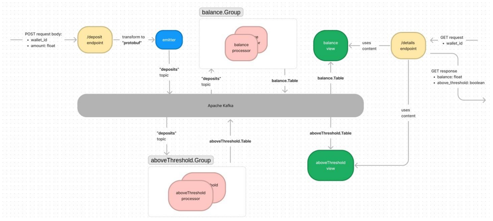

# Wallet Service

This is a ficticious wallet service where user can deposit money into their wallet and fetch their current balance using Event-Driven architecture design.

This wallet service offers two endpoints:

1. `localhost:8080/deposit`

   HTTP POST endpoint for user to deposit money

2. `localhost:8080/details/{wallet_id}`

   HTTP GET endpoint to get the balance of the wallet, and also a flag whether the wallet has ever done one
   or more deposits with amounts more than 10,000 within a single 2-minute window (rolling-period)

There are 3 architectures requirements for this wallet service :

1. Goka for building the wallet service.
2. protobuf for encoding/decoding payload to/from Kafka broker.
3. Goka's local storage mechanism only if a database is required.

## 1. Basic components and features

Goka provides three components to build systems: emitters, processors, and views.
The following figure depicts initial design using these three components together with Kafka and the endpoints.



### Deposit Endpoint

The main type we will be dealing with is the `DepositRequest` type:

```go
type DepositRequest struct {
	WalletID  string  `json:"WalletID"`
	Amount    float64 `json:"Amount"`
}
```

If someone wants to deposit an amount of money to wallet, he/she needs to send a request to the deposit endpoint with the wallet_id and the amount to deposit.
For example:

```sh
curl -X POST \
    -d '{"WalletID": "walletID001", "Amount": 8000}' \
    http://localhost:8080/deposit
```

The [`deposit handler`](service/service.go#L50) parses message type, completing the [`CreatedAt`](service/service.go#66) field. Afterwards, it emits the message into the [`DepositStream`](wallet.go#L10) topic using the wallet_id as key:

```go
func deposit(emitter *goka.Emitter, stream goka.Stream) func(w http.ResponseWriter, r *http.Request) {
	return func(w http.ResponseWriter, r *http.Request) {
		...
	}
}
```

The emitter is configured to only emit into the [`DepositStream`](wallet.go#L10) topic and to use [`DepositRequestCodec`](wallet.go#L48) to encode the message.
This is how the [emitter](service/service.go#L36) and [handler](service/service.go#L43) are created:

```go
emitter, err := goka.NewEmitter(brokers, stream, new(wallet.DepositRequestCodec))
...
router.HandleFunc("/deposit", deposit(emitter, stream)).Methods("POST")
```

### Balance Processor

We define the _balance table_ to contain `Wallet` type as follows:

```go
type Wallet struct {
	WalletID string  `json:"WalletID"`
	Balance  float64 `json:"Balance"`
}
```

The _balance processor_ keeps the table up-to-date by consuming [`DepositStream`](wallet.go#L10).
The balance callback is defined as [follows](balance/balance.go#L18):

```go
func balance(ctx goka.Context, msg interface{}) {
	w := new(pb_wallet.Wallet)
	dr := msg.(*pb_wallet.DepositRequest)

	if v := ctx.Value(); v != nil {
		w = v.(*pb_wallet.Wallet)
	} else {
		w.WalletID = dr.WalletID
	}

	w.Balance += dr.Amount

	ctx.SetValue(w)
}
```

The `ctx` is scoped with the key of the input message -- which in this case is a wallet_id.
With `ctx.Value()` we fetch the table value for that key.
In this processor, the value is a `Wallet` type.
We then update its balance field by adding it with latest deposit amount.
Finally, we store the value back in the table with `ctx.SetValue()`.

To create the processor, we need to define the group input stream and table persistency:

```go
g := goka.DefineGroup(group,
    // input stream is DepositStream with DepositRequestCodec and balance callback
    goka.Input(wallet.DepositStream, new(wallet.DepositRequestCodec), balance),
    // the group table ("balance-table") persists *Wallet type
    goka.Persist(new(wallet.WalletCodec)),
)
p, err := goka.NewProcessor(brokers, g)
```

### Above Threshold Processor

We define the _above threshold table_ to contain `WalletInfoList` which field `List` contains list of `WalletInfo` pointer as follows:

```go
type WalletInfoList struct {
	List []*WalletInfo `json:"List"`
}

type WalletInfo struct {
	WalletID            string  `json:"WalletID"`
	LastDepositAmount   float64 `json:"LastDepositAmount"`
	TwoMinuteCumulative float64 `json:"TwoMinuteCumulative"`
	AboveThreshold      bool    `json:"AboveThreshold"`
	CreatedAt           int64   `json:"CreatedAt"`
}
```

The _above_threshold processor_ keeps the table up-to-date by consuming [`DepositStream`](wallet.go#L10).
The aboveThreshold callback is defined as follows (for more details, see [here](above_threshold/above_threshold.go#L23)):

```go
func aboveThreshold(ctx goka.Context, msg interface{}) {
	wil := new(pb_wallet.WalletInfoList)
	if v := ctx.Value(); v != nil {
		wil = v.(*pb_wallet.WalletInfoList)
	}

	dr := msg.(*pb_wallet.DepositRequest)

	...
}
```

The group input stream and table persistency is define as follows:

```go
g := goka.DefineGroup(group,
    // input stream is DepositStream with DepositRequestCodec and aboveThreshold callback
    goka.Input(wallet.DepositStream, new(wallet.DepositRequestCodec), aboveThreshold),
    // the group table ("above_threshold-table") persists *WalletInfoList type
    goka.Persist(new(wallet.WalletInfoListCodec)),
)
p, err := goka.NewProcessor(brokers, g)
```

### Details Endpoint

When someone wants to see his/her current wallet balance, he/she requests that from the details endpoint.
For example:

```
$ curl http://localhost:8080/details/walletID001
{"WalletID":"walletID001","Balance":8000,"AboveThreshold":false}
```

The [`details handler`](service/service.go#L79) employs a view on `balance.Table` and `above_threshold.Table` to retrieve the current wallet balance with threshold flag for Alice.

```go
func details(balanceView, aboveThresholdView *goka.View) func(w http.ResponseWriter, r *http.Request) {
	return func(w http.ResponseWriter, r *http.Request) {
		...
	}
}
```

When creating the view, it is configured to watch the `balance.Table` and `above_threshold.Table` by decoding each of them in order with `WalletCodec` and `WalletInfoListCodec`.

```go
balanceView, err := goka.NewView(brokers, balance.Table, new(wallet.WalletCodec))
...
aboveThresholdView, err := goka.NewView(brokers, above_threshold.Table, new(wallet.WalletInfoListCodec))
...
router.HandleFunc("/details/{wallet_id}", details(balanceView, aboveThresholdView)).Methods("GET")
```

For codec implementation details see [wallet.go](wallet.go) file for details.

## 2. Running the example

In order for this service to be running properly, the tools, frameworks and language may required to be updated to the latest.

Att the time this service run successfully, golang and docker compose version that are used are as follows:

```sh
go version go1.20 linux/amd64
Docker Compose version v2.12.1
```

Before starting the service, change to this directory and remember to execute this command to resolve golang dependencies:

```sh
go mod tidy
```

To start the service, execute these commands in order, each in separate terminal:

1. Start the Kafka broker (this may require sudo if failed)

```sh
make broker-up
```

2. Start the processor (to activate balance and above_threshold processor)

```
make processor
```

3. Start the service (for endpoint handlers, emitter and view)

```
make api
```

After all Go programs have been started, you can use `curl` to do a deposit request:

```sh
curl -X POST \
    -d '{"WalletID": "walletID001", "Amount": 8000}' \
    http://localhost:8080/deposit
```

Then after that use `curl` to see deposited wallet balance by doing following request:

```sh
curl http://localhost:8080/details/walletID001
```

or open [http://localhost:8080/details/walletID001](http://localhost:8080/details/walletID001) in the browser.
